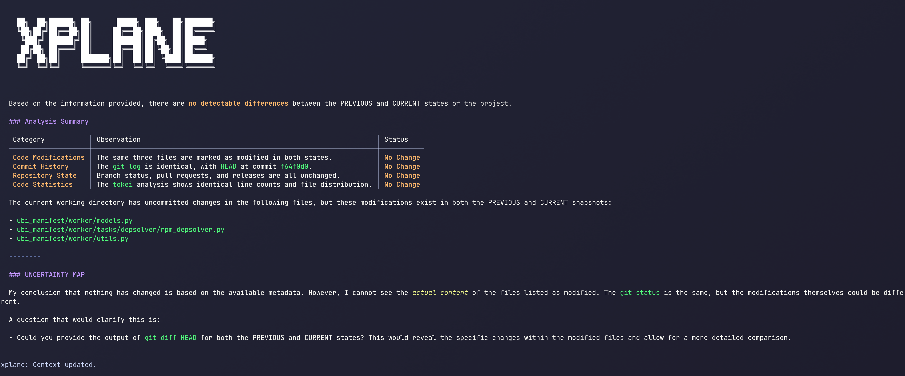

# xplane ✈️



A smart project assistant for your shell, designed to give you an intelligent summary of your project's status every time you `cd` into it.

---

## What is xplane?

`xplane` is a command-line tool that hooks into `direnv` to create a context-aware shell environment. On entering a project directory, it runs a series of configurable commands (like `git status`, `tokei`, and `ripsecrets`) and fetches remote information (like open GitHub Pull Requests).

It compares this "dynamic context" to the last known state. If anything has changed, `xplane` uses a Large Language Model (LLM) to generate a brief, human-readable summary of what's new.

The result is a personal project assistant that can tell you things like:
* "A new PR was opened by Jane Doe."
* "Your local branch is 3 commits behind main."
* "You've added 200 lines of Go code and potentially leaked a new secret."

---

## How It Works

1.  **Triggered by `direnv`:** When you `cd` into a directory with a configured `.envrc`, `xplane` is executed.
2.  **Gathers Context:** It runs the commands defined in your configuration to build a "dynamic context" of the project's current state. This includes local git status, code statistics, and remote pull requests.
3.  **Compares State:** The newly gathered context is compared against the last known state, stored in `.xplane/dynamic_context.txt`. If they are identical, the program prints "✅ No new updates." and exits.
4.  **Builds Prompt:** If the context has changed, `xplane` combines the previous and current dynamic contexts with a user-configurable prompt template located at `.xplane/static_context.txt`.
5.  **Generates Summary:** This final prompt is sent to a configured LLM provider (e.g., Gemini), which generates a summary of the changes.
6.  **Updates State:** The new dynamic context is saved, ready for the next comparison.

---

## Installation & Setup

#### 1. Build the Binary
Clone this repository and build the `xplane` executable.

```sh
git clone https://github.com/Gdetrane/xplane
cd xplane
go build .
```
Then, move the generated `xplane` binary to a directory in your system's `$PATH` (e.g. `/usr/local/bin`).

#### 2. Install Dependencies
`xplane` relies on a few external tools for its default command set. Please ensure the following are installed and available in your `$PATH`:
+ `git`
+ `tokei` (for code statistics)
+ `ripsecrets` (for finding leaked secrets)

#### 3. Configure `direnv`
In your project's `.envrc` file, simply add the `xplane` command. This will execute it every time you enter the directory.

```sh
# .envrc
# ... other direnv setup ...

# Run the xplane assistant
xplane
```

After setting up your `.envrc`, run `direnv allow` to approve it.

---

## Configuration

`xplane` is configured via environment variables, which you should set in your project's `.envrc` file.

| Variable | Description | Default |
| :--- | :--- | :--- |
| **`XPLANE_COMMANDS`** | A comma-separated list of context-gathering commands to run. You can override the defaults or add your own generic commands. | `git_status,git_log,readme,git_exclude,gitignore,git_diff,github_prs,gitlab_mrs,release,git_branch_status,tokei,ripsecrets` |
| **`XPLANE_PROVIDER`** | The LLM provider to use for summaries. Supports `claude_code`, `gemini_cli`, `gemini` (API), and `ollama`. | `gemini_cli` |
| **`XPLANE_MODEL`** | The specific model to use with the selected provider. | `gemini-2.5-pro` |
| **`XPLANE_API_KEY`** | The API key required for API-based providers like `gemini`. | (none) |
| **`GITHUB_TOKEN`** | A Personal Access Token with `repo` scope (read only recommended), required for the `github_prs` command. | (none) |
| **`GITLAB_TOKEN`** | A Personal Access Token, required for the `gitlab_mrs` command (when implemented). | (none) |
| **`XPLANE_OLLAMA_SERVER_ADDRESS`** | The server address for Ollama when using the `ollama` provider. | `http://localhost:11434` |
| **`USE_PROJECT_KNOWLEDGE`** | Enable persistent project knowledge management across sessions. Set to `"true"` to activate. | `false` |

#### Example `.envrc`

```bash
# .envrc

# Configure the LLM provider (choose one)
export XPLANE_PROVIDER="claude_code"              # Uses Claude Code CLI
# export XPLANE_PROVIDER="gemini_cli"             # Uses Gemini CLI
# export XPLANE_PROVIDER="ollama"                 # Uses local Ollama
# export XPLANE_PROVIDER="gemini"                 # Uses Gemini API

# Set model (optional, has sensible defaults)
export XPLANE_MODEL="claude-sonnet-4"

# Customize the commands to run (optional, defaults include all built-in commands)
export XPLANE_COMMANDS="git_status,git_diff,github_prs,tokei,ripsecrets"

# Provide required tokens
export GITHUB_TOKEN="ghp_xxxxxxxxxxxxxxxxxxxxxxxx"

# For Ollama provider (optional)
# export XPLANE_OLLAMA_SERVER_ADDRESS="http://localhost:11434"

# For Gemini API provider (if using XPLANE_PROVIDER="gemini")
# export XPLANE_API_KEY="your_gemini_api_key_here"

# Enable persistent project knowledge (optional)
# export USE_PROJECT_KNOWLEDGE="true"

# Run xplane
xplane
```


The first time you run `xplane` in a project, it will automatically create a `.xplane/static_context.txt` file. You can edit this file to customize the persona and instructions for the LLM.

### 🧠 Project Knowledge Management

**Transform xplane into an intelligent project companion** by enabling persistent knowledge accumulation with `USE_PROJECT_KNOWLEDGE="true"`. This powerful feature maintains a living timeline of your project's evolution in `.xplane/KNOWLEDGE.md`.

#### How Knowledge Management Works
- **Automatic Timeline Creation**: Each xplane run that detects significant changes generates timestamped knowledge updates
- **Timeline-Based Accumulation**: New insights are prepended to preserve development history chronologically
- **Intelligent Triggers**: Knowledge updates are created for architectural changes, new features, bug fixes, dependency updates, and workflow changes
- **Context-Aware Learning**: The LLM references existing knowledge to provide increasingly informed analysis

#### Key Benefits
- **📚 Institutional Memory**: Preserve critical lessons learned, architectural decisions, and development patterns
- **🔄 Continuous Learning**: Each development session builds upon previous insights
- **⏰ Development Timeline**: Clear chronological record of project evolution
- **🎯 Context-Rich Analysis**: Future summaries become more relevant as knowledge accumulates
- **🏗️ Architecture Documentation**: Automatic capture of stack changes, migrations, and technical decisions

#### Example Knowledge Capture
```markdown
## Latest Update (2025-08-27 20:25:35)

### Architecture
- **Full-Stack Implementation**: Complete transition to Go backend + SQLite
- **Theme System Architecture**: Advanced theming with 12 predefined themes

### Important Patterns  
- **sqlc Code Generation**: Type-safe database operations
- **Theme Composable Pattern**: Vue 3 composable with localStorage persistence

---

## Previous Knowledge
[Historical development insights preserved...]
```

The knowledge system automatically initializes on first run and requires no manual maintenance - simply develop your project and watch xplane build comprehensive institutional knowledge over time.

---

## Built-in Commands

`xplane` includes several built-in commands that provide specialized context gathering:

### Git Commands
- **`git_status`** - Shows current git working tree status
- **`git_log`** - Displays recent commit history
- **`git_diff`** - Shows current uncommitted changes with timestamp
- **`git_exclude`** - Reads local git exclusions from `.git/info/exclude`
- **`git_branch_status`** - Compares current branch with upstream/main
- **`gitignore`** - Reads project-wide git exclusions from `.gitignore`

### Remote Repository Commands  
- **`github_prs`** - Fetches open GitHub pull requests
- **`gitlab_mrs`** - Fetches open GitLab merge requests (when implemented)
- **`release`** - Shows latest release information

### Analysis Commands
- **`tokei`** - Code statistics and line counts
- **`ripsecrets`** - Scans for potentially leaked secrets
- **`readme`** - Reads the project README file

You can also add custom generic commands by including them in `XPLANE_COMMANDS`.

---

## Roadmap & TODO

- [x] Core state-diffing logic
- [x] Modular `LLMProvider` interface
- [x] Modular `GitProvider` interface
- [x] Configurable command runner via `XPLANE_COMMANDS`
- [x] Support for fork-based workflows (`upstream` remote)
- [x] Implemented `gemini_cli` provider
- [x] Implemented `github` provider
- [x] Implement `ollama` provider
- [x] Implement `claude_code` provider
- [x] Add more built-in context commands (`git_diff`, `git_exclude`, `gitignore`, `git_branch_status`, `release`)
- [x] Implement fancy output formatting
- [x] Add persistent project knowledge management system
- [ ] Add more methods to `GitProvider`
- [ ] Implement `gitlab` and eventually more niche providers like `gitea` or `codeberg`
- [ ] Add configuration validation and better error messages
- [ ] Add comprehensive test suite
- [ ] Add support for custom LLM prompt templates

